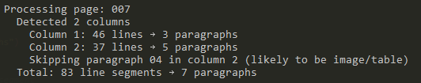

## Description

A project that automatically extracts paragraphs from document images using computer vision techniques. This tool analyzes document structure by detecting columns and rows, then merges text lines into paragraphs while attempting to filter out images and tables.

## Reference

| Example Image | Output |
|--------|----------------|
|  |  |

## Requirements

- Python 3.12.3 or compatible
- Numpy library

## How to Run

1. Place your document images (PNG format) in the `Converted Paper (8)` directory or use the images provided
2. Install numpy if not already installed:
    ```bash
    pip install opencv-python numpy
    ```
4. Run the script:
   ```bash
   python main.py
   ```
5. Extracted paragraphs will be saved as individual images in the `outputs` directory
